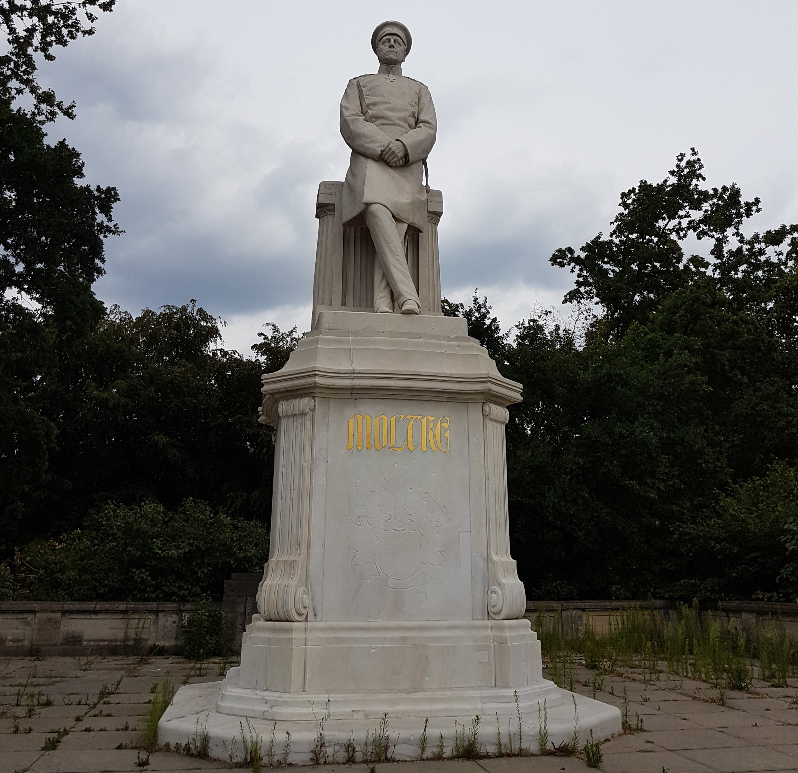

+++
title = "No Plan Survives Contact With the Enemy"
subtitle = "Why I Find Scheduling My Studying To Be Worse Than Useless"
summary = "Why I Find Scheduling My Studying To Be Worse Than Useless"
authors = []
tags = []
categories = []
date = "2021-10-08"
lastmod = "2021-10-08"
featured = false
draft = false

[image]
caption = ""
focal_point = ""
preview_only = false

projects = []
+++

Several months ago, I arranged a time to work on a group assignment with another student. After we agreed, I watched him open up his Google Calendar and reveal a many-coloured wall of events spanning the entire week, often continuously from 08:00 to 23:00. As someone who thinks of himself as quite organized and methodical, seeing this left something of an impression on me, as I had never gone into that much detail when scheduling my days before. I first thought it was ridiculous. However, I soon wondered whether adopting such a practice would benefit my studies, why I had decided to go as far as I did down the scheduling rabbit hole, and why I had not gone any further than that. After careful consideration, I can conclude that my gut reaction was correct and that his system is utterly ineffective.

I first adopted Google Calendar during orientation at the start of first year, to keep track of all of the orientation group meetings, mock lectures, and social events to attend. I found it rather helpful and decided to continue using it throughout first year. I entered all my classes, exams, and office hours into separate calendars and also used a calendar to store events like group study sessions or social gatherings. However, I never blocked out time for assignments or projects. I kept track of all deadlines in Google Tasks, so they'd neatly render on top of my schedule for the week, but I never set aside an hour for a physics assignment or two for a computer science problem set. I never committed to spending four hours reviewing the day before an exam. Doing so would fundamentally conflict with my aim of maximizing my overall average. To explain why, we must first go back a couple of years, then another one hundred and fifty.

In the summer of 2019, shortly after I had finished secondary school, I travelled to Europe for the first time with my family. While there, we visited London, Berlin, and Paris for five to seven days each (along with day trips to several other cities). In Berlin, in the heart of Tiergarten, the city's largest urban park (assuming one does not count the remnants of Templehof Airport as a true park), there stand three statues of the three Prussian statesmen who forged the German Empire. The [statue of Otto von Bismarck](https://en.wikipedia.org/wiki/Bismarck_Memorial), the Minister-President of Prussia, looms the largest. Nearby, however, stand two other statues: those of Albrecht von Roon, the Prussian Minister of War, and Helmuth von Moltke, the Chief of the Prussian General Staff.

Bismarck, the great diplomat, was flanked by these two men of war because Germany was not unified diplomatically, as Great Britain had been, but instead by, in his own words, "iron and blood". Three wars in the latter half of the nineteenth century propelled Prussia to hegemony: the Dano-Prussian War (often called the Second Schleswig War), the Austro-Prussian War, and the Franco-Prussian War. Roon and especially Moltke were responsible for the military reforms that allowed Prussia and its allies to quickly achieve their aims in those three conflicts.

Molke was a man obsessed with military planning. As Chief of Staff, he oversaw the writing of formal studies of historical conflicts and current politics, so the General Staff could make better, more relevant plans for Prussia's future wars. He was an early adopter of the railway and the telegraph for military use, correctly reasoning that if a nation could effectively marshal its railway infrastructure to transport its armies at the outbreak of war, it would have an immense early advantage in the ensuing campaign. Despite all this, however, Moltke is likely most famous in the English-speaking world for one quote:

> The tactical result of an engagement forms the base for new strategic decisions because victory or defeat in a battle changes the situation to such a degree that no human acumen is able to see beyond the first battle. \[...\] Therefore no plan of operations extends with any certainty beyond the first contact with the main hostile force.

This mouthful of a motto is often simply paraphrased as "No plan survives contact with the enemy". Moltke believed that pre-existing military plans lost much of their value as soon as they were put into action. (Whether he was influenced by the works of Robert Burns when he arrived at this conclusion is unknown to me.) Why, then, did so much of Moltke's tenure consist of making such plans? In the words of President Dwight Eisenhower, "plans are useless but planning is indispensable". Plans can never be counted upon, but the process by which they are made is essential preparation.

You will almost certainly never make a plan that correctly accounts for every possible factor that could change. (If you do, you ought to be inclined to either play the lottery or never play it again, if you exhibit the hot hand fallacy or the gambler's fallacy, respectively.) Instead, the key to preparedness is to have several plans that you can readily switch between, alter, and combine as circumstances change. Naturally, military affairs and schoolwork differ in innumerable ways, but these two quotes and the ideas behind them map onto the problem of planning out homework and studying quite nicely.

Quite frankly, I have no idea how long most tasks will take to complete. I can hardly count the number of times I expected to blitz through a homework assignment in an afternoon, only to require a whole week's effort to solve the last problem, or the number of times I expected to spend a full day internalizing a concept only to find that I understood it in half an hour. If I can't be counted on to get that estimate right, how could I possibly plan to spend exactly four hours finishing four assignments in sequence, then spend another two hours doing all of my studying for a coming midterm? The simple answer is that I don't. My policy for the past two years has been to only ever plan my academic activities one to two days in advance, in very broad strokes, and non-committally (note that this last point, especially, only applies to solo studying). When homework or an exam is announced, I note the date or deadline, take a cursory look at my schedule to see what sort of room I have to work with (taking work for my other courses into account), and go from there.

In my experience, this sort of loose planning carries the best of both worlds. It's enough to get me to sit down and start working, but then I'm free to adapt as needed. If I nail down a concept for an upcoming quiz early, I move on to some other work and maybe do one last quick review at the end of the evening. If I'm struggling, I can allocate extra time or delay, as needed. If I have an epiphany for an unrelated assignment, I can pivot to that. As circumstances change, so do my plans.

Given all of this, one may wonder why individuals like the one whose calendar I glimpsed organize themselves in this way. There are certainly some who do it simply to motivate themselves. It is typically better to spend an hour forcing yourself to study linear algebra than it is to spend that same hour procrastinating. If that is what inordinately rigid scheduling provides for some people, I don't aim to belittle their choice to use it at all. The cases that interest me are those where people I consider to be highly motivated and productive still end up doing this to themselves. Unless I chronically misjudge how much others rely on scheduling out their work to force themselves to get it done, they have no real need to meticulously plan out when they will complete which tasks.

It seems to me that, for many people, this sort of excessive scheduling serves primarily to create an aesthetic of organization and productivity, either for the consumption of others or themselves. It's not unlike when people post pictures of their course notes written in beautiful cursive in premium notebooks. Whether or not people actually follow their schedules laden with study sessions or even use their artistically-rendered notes is irrelevant. They were created, consciously or not, as a performance: propaganda. Looking back, probably the only reason I even had that multi-coloured wall of calendar events shoved in my face in the first place was that its author was proud of it. More than anything else, it reminds me of Matthew 6:16-18. That said, not everyone's aims are so nakedly self-aggrandizing and, for some, being able to think of themselves as highly organized and productive is a valuable confidence boost. For me, while I can see the appeal of convincing myself that I am more capable than I am (indeed, I am guilty of doing this right before I begin exams), as I get older, I increasingly see the value in honest reflection on my habits and my capabilities, rather than admittedly useful self-deception which one must maintain for an entire term.

In the end, unexpected breakthroughs and setbacks are inevitable, and there is little purpose in trying to have every detail planned out save for making it appear that you have every detail planned out. That sort of rigidity only serves to let you follow in the footsteps of the Danish, Austrian, and French armies of the mid to late nineteenth century.
